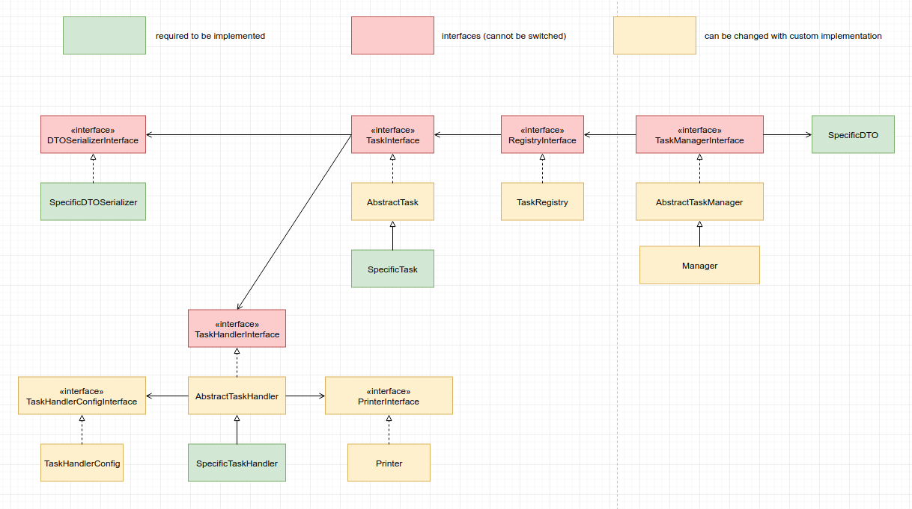

## Installation

```console
composer require mnk1985/amqp-tasks-bundle
```

add RabbitMQ connection details to .env file. e.g.

```
RABBITMQ_HOST=localhost
RABBITMQ_PORT=5672
RABBITMQ_USER=guest
RABBITMQ_PASSWORD=guest
```

## Base components:
- Task - stores queue name in the underlying queue system, knows its handler and dto serializer
- DTO - data structure which stores all the data we need to pass in order to be able to process job asynchronously (e.g. to make async search we can pass some filter details)
- DTOSerializer - is an object which can transform dto to string and vice versa
- TaskHandler - receives dto and does processing (any components can be injected if needed)

UML class diagram may be helpful for visualization



## Examples

Task (should implement TaskInterface or extend AbstractTask). getQueueName should return real queue name used to store/retrieve data from queue driver. TestTask::getDTOSerializer returns specific to your task serializer.  TestTask::getHandler returns task's handler. The convention is that handler comes with 'Handler' suffix to task name (e.g. from TestTask we get TestTaskHandler, but it can be overwritten via TestTask::setHandler) 
```php
<?php namespace App\Tasks\Test;

use AmqpTasksBundle\DTO\DTOSerializerInterface;
use AmqpTasksBundle\Tasks\AbstractTask;

class TestTask extends AbstractTask
{
    public function getQueueName(): string
    {
        return 'test_queue';
    }

    public function getDTOSerializer(): DTOSerializerInterface
    {
        return new DTOSerializer();
    }
}
```

TaskHandler (should implement TaskhandlerInterface or extend AbstractTaskHandler) - here you can process your task. if it's processed successfully - return true, otherwise - false.

```php
<?php namespace App\Tasks\Test;

use AmqpTasksBundle\Exception\InvalidDTOException;
use AmqpTasksBundle\Tasks\AbstractTaskHandler;

class TestTaskHandler extends AbstractTaskHandler
{
    /**
     * @param TestDTO $message
     * @return bool
     */
    public function process($dto): bool
    {
        if (!$dto instanceof TestDTO) {
            throw new InvalidDTOException();
        }

        if ($dto->getFieldA() && $dto->getFieldB()) {
            return true;
        }

        return false;
    }

}
```

Object that gets passed via queue for async processing 
```php
<?php namespace App\Tasks\Test;

class TestDTO
{
    private $fieldA;
    private $fieldB;

    public function __construct($fieldA = null, $fieldB = null)
    {
        $this->fieldA = $fieldA;
        $this->fieldB = $fieldB;
    }

    public function getFieldA(): ?string
    {
        return $this->fieldA;
    }

    public function setFieldA(?string $fieldA): self
    {
        $this->fieldA = $fieldA;

        return $this;
    }

    public function getFieldB(): ?int
    {
        return $this->fieldB;
    }

    public function setFieldB(?int $fieldB): self
    {
        $this->fieldB = $fieldB;

        return $this;
    }
}
```
Serializer should implement DTOSerializerInterface (with 2 methods - convert to string and from string) 
```php
<?php namespace App\Tasks\Test;

use AmqpTasksBundle\DTO\DTOSerializerInterface;

class DTOSerializer implements DTOSerializerInterface
{
    /**
     * @param TestDTO $dto
     * @return string
     */
    public function convertToString($dto): string
    {
        $fields = [
            'fieldA' => $dto->getFieldA(),
            'fieldB' => $dto->getFieldB(),
        ];
        return json_encode($fields);
    }

    /**
     * @param string $data
     * @return TestDTO
     */
    public function createDTO(string $data)
    {
        $fields = json_decode($data, true);

        $new = new TestDTO();
        $new->setFieldA($fields['fieldA'] ?? null);
        $new->setFieldB($fields['fieldB'] ?? null);

        return $new;
    }
}
```

console command for processing tasks. 

```console
./bin/console amqp_tasks:run-worker test_queue --verbose --iterations=100 --attempts=2 --delay=1 --env=dev
```
without --verbose task payload won't be outputted (to console screen or supervisor log)
--iterations=0 (by default) makes worker running "forever" (you may set it to 100. when task is executed as times as iterations is defined, will die, but supervisord will alive it again)
--attempts=2 - make another try if fist processing failed
--delay - delay in seconds when retry after fail

## Remarks
This code is still under development, and no release is yet ready. Please be patient.

## TODO
- add driver configuration
- move printOutput to separate class
